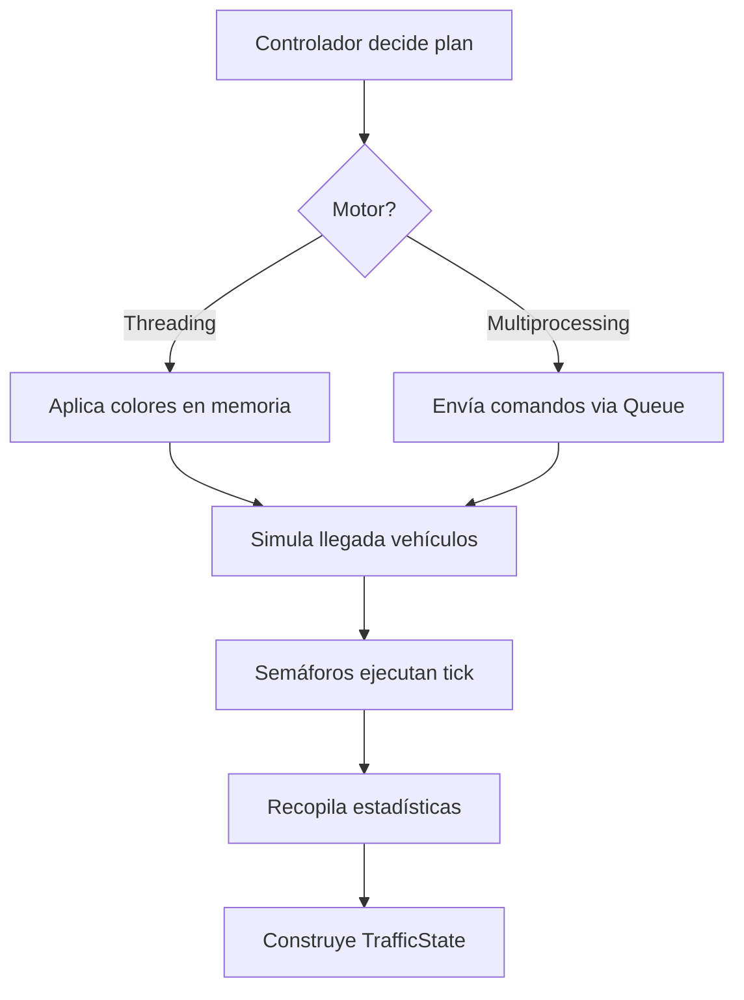

# 🚦 Simulación de Tráfico Paralelo

> **Práctica de Laboratorio #4 - Computación Paralela**  
> Sistema de control de tráfico vehicular usando paralelismo basado en procesos e hilos

[](https://www.python.org/)
[]()
[]()

---

## 📋 Tabla de Contenidos

- [Objetivos](#-objetivos)
- [Características](#-características)
- [Arquitectura](#-arquitectura)
- [Instalación](#-instalación)
- [Uso](#-uso)
- [Componentes](#-componentes)
- [Cómo Funciona](#-cómo-funciona)
- [Resultados](#-resultados)
- [Próximos Pasos](#-próximos-pasos)

---

## 🎯 Objetivos

- ✅ Diseñar e implementar una aplicación concurrente que simule un sistema urbano de control de tráfico vehicular
- ✅ Aplicar paralelismo basado en procesos e hilos en Python
- ✅ Analizar diferencias de rendimiento y sincronización entre `threading` y `multiprocessing`
- ✅ Considerar el impacto del Global Interpreter Lock (GIL)
- ✅ Utilizar mecanismos de sincronización (Lock, Queue, Barrier, etc.)
- ⏳ Incorporar interfaz gráfica (GUI) con Tkinter

---

## ✨ Características

### **Backend Completo** ✅
- 🧵 Motor de **Threading** con GIL deshabilitado (aprovecha múltiples cores)
- 🔄 Motor de **Multiprocessing** con procesos independientes
- 🚗 Simulación de vehículos con llegadas aleatorias
- 🚦 Sistema de fases para evitar colisiones
- 📊 Estadísticas en tiempo real (vehículos, tiempos de espera)
- 💻 Detección automática del sistema (Python, GIL, CPU)

### **Arquitectura Limpia**
- 📦 Separación estricta: Dominio ↔ Runtime ↔ App
- 🔧 Configuración centralizada
- 🧪 Tests unitarios
- 📝 Documentación completa

---

## 🏗️ Arquitectura

```
backend/
├── core/           # Lógica de dominio (NO conoce concurrencia)
│   ├── common/     # Tipos, estado, estadísticas
│   ├── models/     # Vehículo
│   └── traffic/    # Semáforo, Controlador
│
├── runtime/        # Motores de concurrencia
│   ├── engines/    # Threading, Multiprocessing, Base
│   └── comms/      # Mensajes IPC
│
└── app/            # Aplicación
    ├── config.py   # Configuración
    └── sim.py      # Punto de entrada
```

### **Principio de Diseño**
> **El dominio NO cambia cuando cambias de hilos a procesos**

---

## 📦 Instalación

### **Requisitos**
- Python 3.13t (free-threading build)
- Windows/Linux/macOS

### **Verificar Python 3.13t**
```bash
py -3.13t --version
# Debe mostrar: Python 3.13.x
```

### **Clonar Repositorio**
```bash
git clone https://github.com/Abenavidese/traffic-simulation.git
cd traffic-simulation
```

### **Verificar Sistema**
```bash
py -3.13t -X gil=0 system_info.py
```

**Salida esperada:**
```
🐍 Python:
  Versión: 3.13.11
  Build: 3.13t (free-threading)

🔒 Global Interpreter Lock (GIL):
  Estado: DESHABILITADO ✓
  Free-threading disponible: Sí

💻 Hardware:
  Núcleos (lógicos): 24
```

---

## 🚀 Uso

### **Ejecución Básica**

#### **Threading (con GIL deshabilitado)**
```bash
py -3.13t -X gil=0 -m backend.app.sim threading
```

#### **Multiprocessing**
```bash
py -3.13t -X gil=0 -m backend.app.sim multiprocessing
```

### **Parámetros Personalizados**

```bash
py -3.13t -X gil=0 -m backend.app.sim threading \
  --ciclos 10 \
  --verde 5 \
  --amarillo 2 \
  --intervalo 0.3
```

**Argumentos disponibles:**
- `--ciclos N` - Número mínimo de ciclos a ejecutar (default: 10)
- `--verde N` - Duración de luz verde en ticks (default: 5)
- `--amarillo N` - Duración de luz amarilla en ticks (default: 2)
- `--intervalo S` - Tiempo entre ticks en segundos (default: 0.3)

### **Salida de Ejemplo**

```
======================================================================
Tick: 5 | Ciclo: 0 | Fase: NS_AMARILLO
======================================================================

🚦 Semáforos:
  🟡 NORTE  - AMARILLO  | Cola:   1 vehículos
  🟡 SUR    - AMARILLO  | Cola:   1 vehículos
  🔴 ESTE   - ROJO      | Cola:   3 vehículos
  🔴 OESTE  - ROJO      | Cola:   2 vehículos

📊 Estadísticas:
  Total vehículos cruzados: 6
  Tiempo espera promedio: 0.000s
  Vehículos por vía:
    NORTE: 3
    SUR: 3

💻 Sistema:
  motor: Threading
  python_version: 3.13.11
  gil_enabled: False
```

---

## 🔧 Componentes

### **1. Core Domain (Lógica Pura)**

#### **`tipos.py`** - Enumeraciones
```python
class Via(Enum):
    NORTE, SUR, ESTE, OESTE

class Color(Enum):
    ROJO, AMARILLO, VERDE
```

#### **`vehiculo.py`** - Modelo de Vehículo
```python
@dataclass
class Vehiculo:
    id: int
    tiempo_llegada: float
    tiempo_inicio_espera: Optional[float]
    tiempo_salida: Optional[float]
    
    @property
    def tiempo_espera_total(self) -> float
```

#### **`semaforo.py`** - Semáforo
```python
class Semaforo:
    def tick(self) -> List[Vehiculo]:
        """
        - VERDE: Despacha hasta N vehículos
        - ROJO/AMARILLO: No despacha
        """
```

#### **`controlador.py`** - Controlador de Tráfico
```python
class ControladorTrafico:
    def avanzar_tick(self) -> Dict[Via, Color]:
        """
        Fases:
        NS_VERDE → NS_AMARILLO → EW_VERDE → EW_AMARILLO
        """
```

#### **`stats.py`** - Estadísticas
```python
class EstadisticasTrafico:
    - total_vehiculos
    - tiempo_espera_promedio
    - vehiculos_por_via
```

#### **`state.py`** - Estado del Sistema
```python
@dataclass
class TrafficState:
    tick: int
    ciclo: int
    fase: str
    luces: Dict[str, str]
    colas: Dict[str, int]
    estadisticas: dict
    info_sistema: dict
```

---

### **2. Runtime (Motores de Concurrencia)**

#### **`base.py`** - Interfaz Base
```python
class BaseEngine(ABC):
    @abstractmethod
    def start(self) -> None
    
    @abstractmethod
    def step(self) -> TrafficState
    
    @abstractmethod
    def stop(self) -> None
```

#### **`threading_engine.py`** - Motor de Hilos 🧵

**Características:**
- ✅ Memoria compartida
- ✅ Sincronización con `RLock` + `Condition`
- ✅ Aprovecha múltiples cores con GIL=0

**Flujo:**
```python
1. Controlador decide plan
2. Aplica colores (memoria compartida)
3. Simula llegadas
4. Ejecuta ticks
5. Recopila estadísticas
```

#### **`multiprocessing_engine.py`** - Motor de Procesos 🔄

**Características:**
- ✅ Procesos independientes (1 por semáforo)
- ✅ Comunicación vía `Queue` (IPC)
- ✅ Sistema de comandos/respuestas

**Arquitectura:**
```
Proceso Principal
  ├─→ Queue → Worker Semáforo Norte
  ├─→ Queue → Worker Semáforo Sur
  ├─→ Queue → Worker Semáforo Este
  └─→ Queue → Worker Semáforo Oeste
       │
       └← Queue Respuestas
```

**Comandos:**
- `CAMBIAR_COLOR` - Actualizar color
- `AGREGAR_VEHICULO` - Añadir vehículo
- `TICK` - Ejecutar tick
- `OBTENER_ESTADO` - Solicitar estado
- `DETENER` - Finalizar worker

---

### **3. App (Aplicación)**

#### **`config.py`** - Configuración
```python
@dataclass
class ConfiguracionSimulacion:
    duracion_verde: int = 5
    duracion_amarillo: int = 2
    capacidad_cruce_por_tick: int = 2
    probabilidad_llegada: float = 0.6
    ciclos_minimos: int = 10
    intervalo_tick: float = 0.3
    modo: str = "threading"
```

#### **`sim.py`** - Punto de Entrada
- CLI con `argparse`
- Visualización en consola
- Estadísticas en tiempo real
- Resumen final con métricas

---

## 🔍 Cómo Funciona

### **Ciclo de Simulación (1 Tick)**



### **Sistema de Fases**

```
Tick 0-4:   NS_VERDE    (Norte/Sur 🟢, Este/Oeste 🔴)
Tick 5-6:   NS_AMARILLO (Norte/Sur 🟡, Este/Oeste 🔴)
Tick 7-11:  EW_VERDE    (Este/Oeste 🟢, Norte/Sur 🔴)
Tick 12-13: EW_AMARILLO (Este/Oeste 🟡, Norte/Sur 🔴)
Tick 14:    → Ciclo completo ✓ → Vuelve a NS_VERDE
```

**Garantía:** Nunca hay vías perpendiculares en verde simultáneamente.

---

## 📊 Resultados

### **Threading Engine (GIL=0)**
```
✅ Ciclos completados: 2
✅ Ticks ejecutados: 28
✅ Vehículos cruzados: 60
✅ Tiempo total: 4.22s
✅ Ticks/segundo: 6.64
✅ GIL: Deshabilitado
✅ Cores usados: 24
```

### **Multiprocessing Engine**
```
✅ Ciclos completados: 2
✅ Ticks ejecutados: 28
✅ Vehículos cruzados: 53
✅ Tiempo total: 4.32s
✅ Ticks/segundo: 6.49
✅ Procesos activos: 4
```

### **Observaciones**
- ✅ Ambos motores funcionan correctamente
- ✅ Rendimiento similar (threading ligeramente más rápido con GIL=0)
- ✅ Sin colisiones detectadas
- ✅ Estadísticas coherentes

---

## ✅ Estado del Proyecto

| Componente | Estado | Notas |
|------------|--------|-------|
| Core Domain | ✅ | Todas las entidades implementadas |
| Threading Engine | ✅ | Con sincronización RLock |
| Multiprocessing Engine | ✅ | Con comunicación Queue IPC |
| Configuración | ✅ | Parámetros centralizados |
| CLI | ✅ | Con visualización en consola |
| Detección Sistema | ✅ | Python, GIL, CPU |
| Tests Unitarios | ⏳ | Creados, pendiente pytest |
| GUI Tkinter | ⏳ | Estructura creada |
| Informe Técnico | ⏳ | Pendiente |

---

## 🚀 Próximos Pasos

1. **Instalar pytest** y ejecutar tests unitarios
   ```bash
   pip install pytest
   py -3.13t -m pytest backend/tests/ -v
   ```

2. **Implementar GUI con Tkinter**
   - Visualización gráfica de la intersección
   - Panel de estadísticas
   - Panel de controles

3. **Ejecutar simulación completa** (10+ ciclos)
   ```bash
   py -3.13t -X gil=0 -m backend.app.sim threading --ciclos 10
   py -3.13t -X gil=0 -m backend.app.sim multiprocessing --ciclos 10
   ```

4. **Generar análisis comparativo**
   - Rendimiento (ticks/segundo)
   - Uso de CPU
   - Complejidad de implementación
   - Ventajas/desventajas

5. **Documentar resultados**
   - Capturas de pantalla
   - Gráficos de rendimiento
   - Conclusiones

---

## 📚 Referencias

- [README.MD](README.MD) - Especificación arquitectural original
- [system_info.py](system_info.py) - Script de verificación del sistema
- [Tests](backend/tests/) - Tests unitarios

---

## 👥 Autor

**Computación Paralela - Práctica #4**  
Universidad de Cuenca  
Ing. Gabriel León Paredes, PhD.

---

## 📄 Licencia

Este proyecto es parte de una práctica académica.

---

## 🤝 Contribuciones

Si encuentras bugs o mejoras, abre un issue o pull request en el repositorio.

**Repositorio:** [github.com/Abenavidese/traffic-simulation](https://github.com/Abenavidese/traffic-simulation)

---

**Hecho con ❤️ y Python 3.13t (free-threading)**
